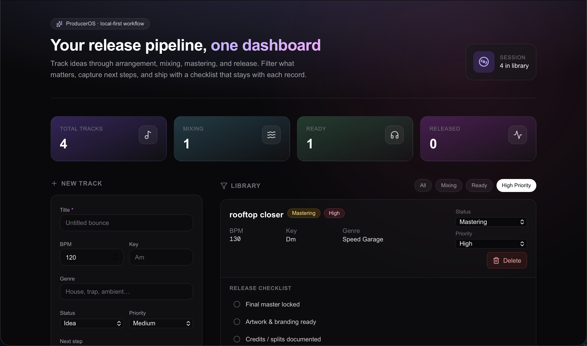

# ProducerOS

A **local-first** music producer workflow dashboard: track releases from idea to mastering, keep next steps visible, and run a per-track release checklist—without leaving the browser.



> **Screenshots:** Replace [`docs/dashboard.svg`](docs/dashboard.svg) with a PNG capture (e.g. `docs/dashboard.png`) when ready, or run the app and use **Show sample layout** / `?screenshot=1` for a framed preview. See [Screenshots](#screenshots).

## Features

- **Hero + pipeline stats** — Total tracks, Mixing, Ready, and Released at a glance.
- **Track pipeline** — Title, BPM, key, genre, status, priority, next step, and notes for every record.
- **Statuses** — Idea → Arrangement → Mixing → Mastering → Ready → Released.
- **Priorities** — Low, Medium, High (with a **High Priority** filter).
- **Filters** — All, Mixing, Ready, and High Priority to focus the queue.
- **Add track form** — Fast capture on the left; validates title before saving.
- **Track cards** — Inline status and priority updates, delete, and expandable context.
- **Release checklist** — Five toggles per track (master, artwork, credits, DSP metadata, promo).
- **Persistence** — Everything saves to **localStorage** (`producer-os-tracks-v1`); first visit seeds demo data; clearing the library keeps an empty list.

## Tech stack

| Layer        | Choice                          |
| ------------ | ------------------------------- |
| Framework    | [Next.js](https://nextjs.org) 16 (App Router) |
| Language     | [TypeScript](https://www.typescriptlang.org) |
| UI           | [Tailwind CSS](https://tailwindcss.com) v4 |
| Icons        | [lucide-react](https://lucide.dev) |
| Fonts        | [Geist](https://vercel.com/font) (via `next/font`) |
| Data         | Browser `localStorage` (no backend in MVP) |

## Screenshots

Place exported images under `docs/` and link them here.

| View | File |
| ---- | ---- |
| Main dashboard (placeholder) |  |

**Tip:** With an empty library, open [http://localhost:3000/?screenshot=1](http://localhost:3000/?screenshot=1) and the app will expand the **sample layout** block—good for a full-width capture without adding fake data to storage. You can also use **Show sample layout** in the empty state at any time.

## Why I built it

I wanted a **single surface** that mirrors how I actually finish records: status and priority are easy to neglect when they live in notes apps or DAW project names. ProducerOS keeps **next steps** and a **release checklist** attached to each track, uses **dark, low-noise UI** for late-night sessions, and stays **offline-friendly** with local persistence—no accounts or cloud required for the MVP.

## Future improvements

- **Accounts & sync** — Optional cloud backup and multi-device sync.
- **Due dates & reminders** — Release targets and calendar export.
- **Attachments** — Link references, stems, or mastering revisions per track.
- **Collaborators** — Shared projects with roles and split reminders.
- **Keyboard shortcuts** — Quick add, filter, and navigate without the mouse.
- **Import / export** — JSON backup for migrations and version control.
- **Theming** — Light mode and custom accent colors.

## Getting started

```bash
npm install
npm run dev
```

Open [http://localhost:3000](http://localhost:3000). Edit the dashboard in [`app/page.tsx`](app/page.tsx).

```bash
npm run build   # production build
npm run start   # run production server
npm run lint    # ESLint
```

## License

Private / your choice — update this section when you publish.
